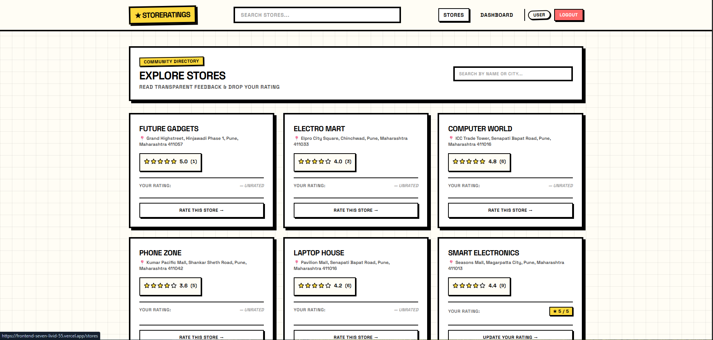
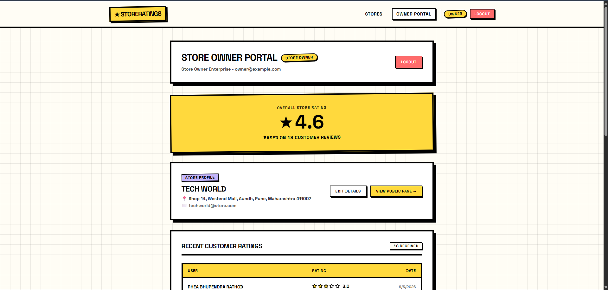
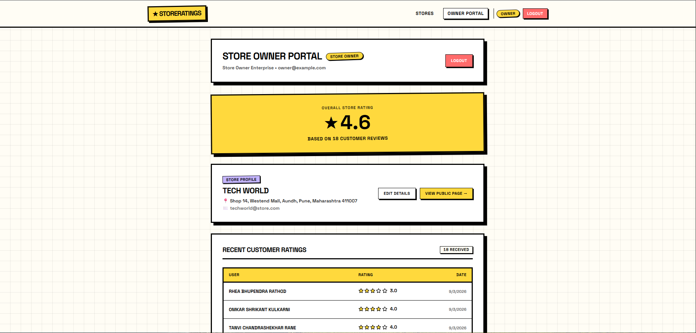

# ⭐ StoreRatings

> **Rate Local Stores. Share Truth. Zero Noise.**

StoreRatings is a full-stack web application that allows customers to discover local stores, submit ratings, and view transparent community feedback.

The platform provides dedicated functionality for **Normal Users, Store Owners, and Administrators**, making it easy to manage stores, ratings, users, and platform activity.

---

## 🚀 Live Demo

🔗 **Live Application:** Add your deployed URL here

---

## 📸 Screenshots

### 🏠 Landing Page

### 🔐 Sign In

### 📝 Create Account

### 🏪 Explore Stores

### 👤 User Dashboard

### ⭐ Store Details

### 🏢 Store Owner Portal

### 📊 Owner Ratings

---

## ✨ Features

### 👤 Normal User

- Create an account
- Secure sign in
- Browse local stores
- Search stores by name or city
- View community ratings
- View total number of ratings
- Rate stores from **1 to 5 stars**
- Update an existing rating
- View rated stores
- User dashboard
- Track rating activity

### 🏪 Store Owner

- Dedicated Store Owner Portal
- Manage store profile
- Edit store details
- View overall store rating
- View total customer ratings
- View recent customer ratings
- View individual customer ratings
- View public store page
- Monitor customer feedback

### 🛡️ Administrator

- Admin dashboard
- Manage users
- Manage stores
- Manage ratings
- Role-based access control
- Search and management functionality
- Platform monitoring and moderation

---

## 🛠️ Tech Stack

### Frontend

- React.js
- Vite
- JavaScript
- HTML5
- CSS3

### Backend

- Node.js
- Express.js

### Database

- PostgreSQL
- Prisma ORM

### Tools

- Git
- GitHub
- VS Code
- npm

---

## 📁 Project Structure

    fullstack-rating-app/
    │
    ├── Backend/
    │   ├── .agents/
    │   ├── .claude/
    │   ├── .cursor/
    │   ├── .devin/
    │   ├── node_modules/
    │   ├── prisma/
    │   ├── scripts/
    │   ├── src/
    │   ├── .env
    │   ├── .env.example
    │   ├── package.json
    │   ├── package-lock.json
    │   └── prisma.config.ts
    │
    ├── Frontend/
    │   ├── node_modules/
    │   ├── public/
    │   ├── src/
    │   │   ├── components/
    │   │   ├── context/
    │   │   ├── hooks/
    │   │   ├── layouts/
    │   │   ├── pages/
    │   │   ├── services/
    │   │   └── utils/
    │   │
    │   ├── app.jsx
    │   ├── index.css
    │   ├── main.jsx
    │   ├── .env
    │   ├── .gitignore
    │   ├── eslint.config.js
    │   ├── index.html
    │   ├── package.json
    │   ├── package-lock.json
    │   └── vite.config.js
    │
    ├── assets/
    │   ├── landing-page.png
    │   ├── signin.png
    │   ├── create-account.png
    │   ├── explore-stores.png
    │   ├── user-dashboard.png
    │   ├── store-details.png
    │   ├── store-owner-portal.png
    │   └── owner-ratings.png
    │
    ├── .gitignore
    └── README.md

> **Note:** `node_modules` should normally be excluded from Git using `.gitignore`.

---

## ⚙️ Installation & Setup

### 1. Clone the Repository

    git clone https://github.com/YOUR_USERNAME/YOUR_REPOSITORY.git

    cd fullstack-rating-app

### 2. Backend Setup

    cd Backend

Install dependencies:

    npm install

Create the environment file:

    cp .env.example .env

Configure your database connection inside `.env`.

Example:

    DATABASE_URL="your_database_connection_string"

Generate Prisma Client:

    npx prisma generate

Run database migrations if required:

    npx prisma migrate dev

Start the backend:

    npm run dev

### 3. Frontend Setup

Open a new terminal:

    cd Frontend

Install dependencies:

    npm install

Start the frontend:

    npm run dev

---

## 🔐 User Roles

| Role | Description |
|------|-------------|
| 👤 Normal User | Browse stores and submit or update ratings |
| 🏪 Store Owner | Manage store information and monitor ratings |
| 🛡️ Administrator | Manage users, stores, ratings, and platform operations |

---

## ⭐ Rating System

Users can rate stores using a **1–5 star rating system**.

    ⭐        1/5
    ⭐⭐      2/5
    ⭐⭐⭐    3/5
    ⭐⭐⭐⭐  4/5
    ⭐⭐⭐⭐⭐ 5/5

Store ratings are displayed using the community rating data.

Example:

    TECH WORLD

    ⭐ 4.6

    18 Customer Ratings

---

## 🔄 Application Flow

    ┌─────────────────────┐
    │   StoreRatings      │
    │      Landing        │
    └──────────┬──────────┘
               │
               ▼
    ┌─────────────────────┐
    │   Authentication    │
    └──────────┬──────────┘
               │
        ┌──────┼──────┐
        │      │      │
        ▼      ▼      ▼
    ┌──────┐ ┌──────┐ ┌──────┐
    │ User │ │Owner │ │Admin │
    └──┬───┘ └──┬───┘ └──┬───┘
       │        │        │
       ▼        ▼        ▼
    Browse   Manage   Manage
    Stores   Store    Platform
       │        │        │
       ▼        ▼        ▼
     Rate    View     Users
    Stores   Ratings  Stores
       │        │     Ratings
       ▼        ▼        ▼
     Update  Feedback  Moderation
     Rating  Insights

---

## 🧩 Main Application Sections

### Authentication

- Sign In
- Create Account
- Role Selection
- Password Validation

### Customer

- Store Directory
- Store Search
- Store Rating
- Rating Update
- User Dashboard

### Store Owner

- Store Owner Portal
- Store Profile
- Customer Ratings
- Store Management
- Public Store Page

### Administrator

- Admin Dashboard
- User Management
- Store Management
- Rating Management
- Platform Controls

---

## 🎨 UI Design

StoreRatings uses a bold and modern interface inspired by retro editorial and brutalist design principles.

### Design Characteristics

- Bold typography
- Yellow, coral, purple and white color palette
- Grid-based background
- Thick black borders
- Offset box shadows
- Card-based layouts
- Clear navigation
- Responsive store listings
- Role indicators
- Strong visual hierarchy

The main design message is:

> **RAW, UNFILTERED & TRANSPARENT RATINGS**

---

## 📊 Example Store

    ┌──────────────────────────────────────┐
    │ TECH WORLD                           │
    │                                      │
    │ 📍 Shop 14, Westend Mall,            │
    │    Aundh, Pune, Maharashtra          │
    │                                      │
    │ ⭐ 4.6                               │
    │                                      │
    │ 18 Customer Ratings                  │
    └──────────────────────────────────────┘

---

## 📋 Example Customer Ratings

    RHEA BHUPENDRA RATHOD
    ⭐⭐⭐☆☆  3.0

    OMKAR SHRIKANT KULKARNI
    ⭐⭐⭐⭐☆  4.0

    TANVI CHANDRASHEKHAR RANE
    ⭐⭐⭐⭐☆  4.0

    NIKHIL PRAKASH GOKHALE
    ⭐⭐⭐⭐☆  4.0

    DEEPIKA MANOHAR TAMBE
    ⭐⭐⭐⭐☆  4.0

---

## 🧠 Key Concepts Demonstrated

This project demonstrates practical implementation of:

- Full-stack application architecture
- React component architecture
- Context API
- Custom React Hooks
- REST APIs
- Authentication
- Authorization
- Role-Based Access Control
- CRUD operations
- Database relationships
- Prisma ORM
- PostgreSQL
- Form validation
- State management
- Search functionality
- Rating aggregation
- Responsive UI development

---

## 🔒 Environment Variables

Never commit sensitive environment variables to GitHub.

The following files should remain local:

    .env

Use `.env.example` to document the required environment variables.

Example:

    DATABASE_URL="your_database_connection_string"

---

## 🚫 Git Ignore

Make sure generated and sensitive files are ignored:

    node_modules/
    .env
    dist/

---

## 🚀 Future Improvements

- Store categories
- Advanced store filtering
- Location-based store discovery
- Pagination
- Rating analytics
- Review comments
- Store owner notifications
- Admin analytics
- Email verification
- Password reset
- Profile management
- Improved mobile responsiveness
- Automated testing
- CI/CD pipeline
- Production deployment

---

## 🎯 Project Objective

The main objective of StoreRatings is to create a transparent platform where customers can share their experiences with local stores while store owners can monitor genuine customer feedback.

The system connects three major stakeholders:

    CUSTOMERS
         │
         │  Submit Ratings
         ▼
    STORE RATINGS
         │
         ├─────────────────┐
         │                 │
         ▼                 ▼
    STORE OWNER        ADMINISTRATOR
         │                 │
         ▼                 ▼
    View Feedback     Manage Platform
    Store Insights    Users / Stores
                      Ratings / Roles

---

## 👨‍💻 Author

**Aditya Sarse**

- GitHub: https://github.com/YOUR_USERNAME
- LinkedIn: https://linkedin.com/in/YOUR_USERNAME

---

## ⭐ Support

If you like this project, consider giving the repository a ⭐ on GitHub.

---

## 📄 License

This project is developed for educational and development purposes.
