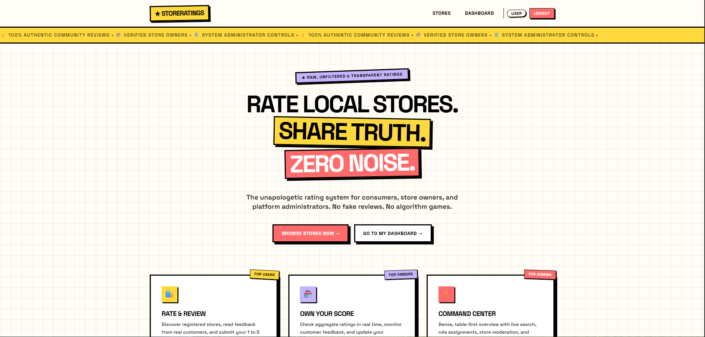
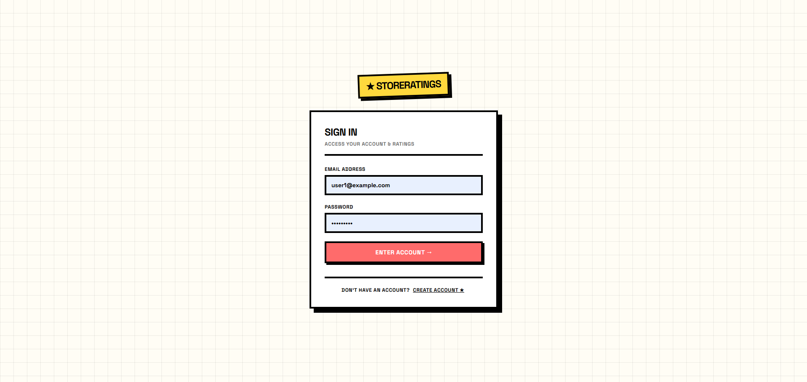
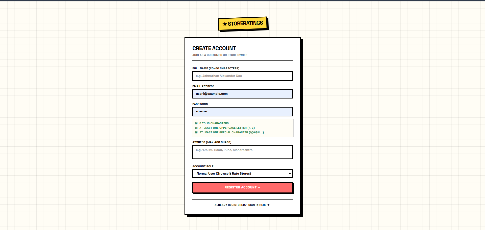
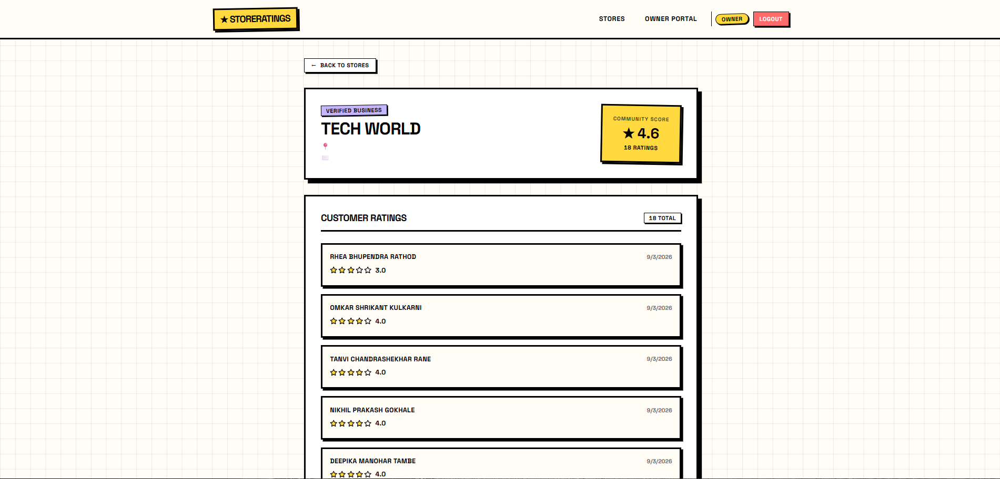
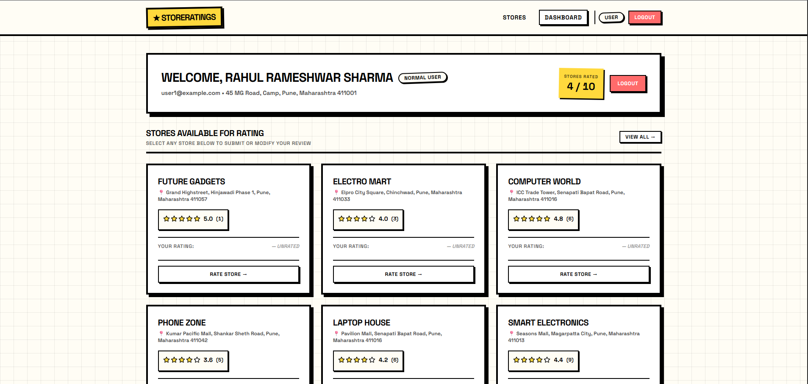
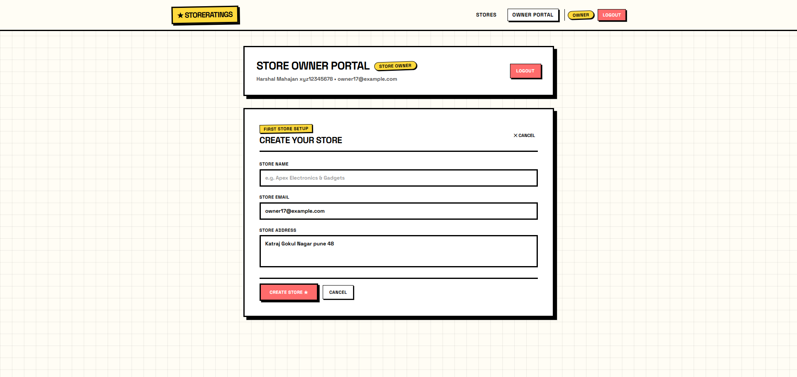
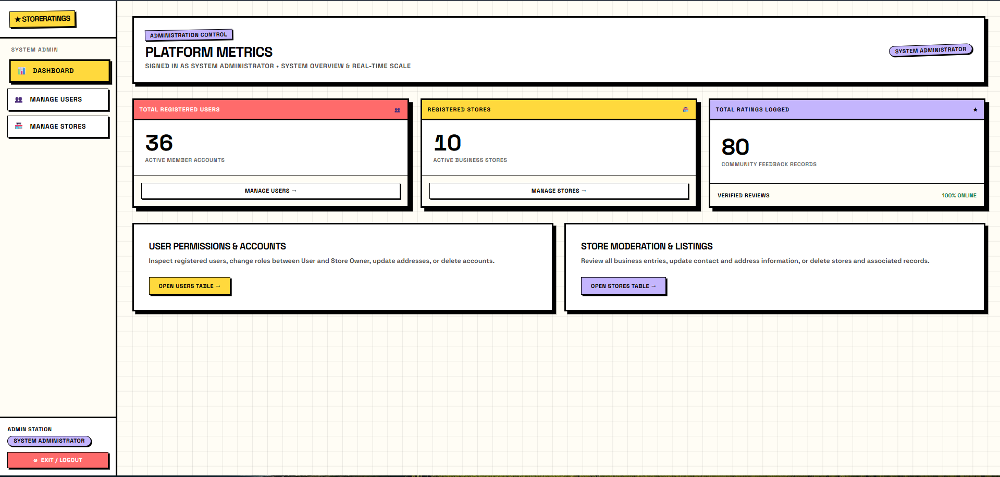
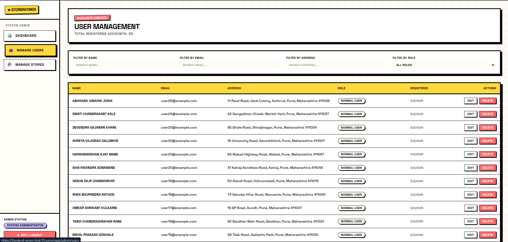
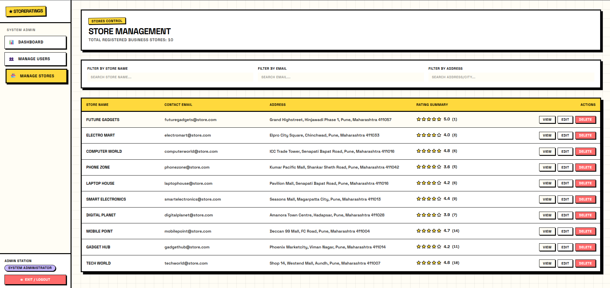
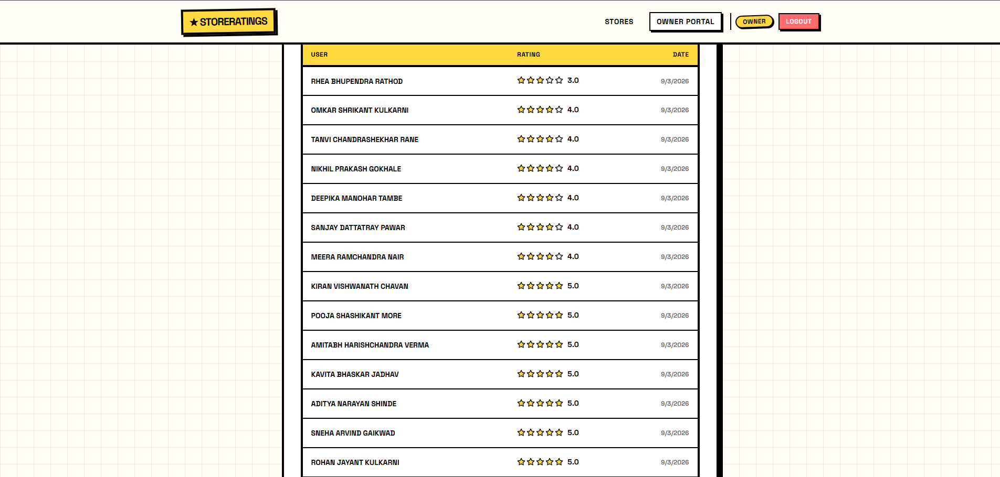

# ⭐ StoreRatings


> **RAW, UNFILTERED & TRANSPARENT RATINGS**

A full-stack store rating and management platform where users can discover stores, submit ratings, store owners can manage their stores and monitor customer feedback, and administrators can manage the entire platform.

---

## 🚀 Live Demo

🌐 **Frontend:** https://your-vercel-url.vercel.app

🔗 **Backend API:** https://fullstack-rating-app.onrender.com

---

## 📌 About The Project

**StoreRatings** is a full-stack web application built to provide a simple and transparent platform for discovering stores and sharing customer ratings.

The application supports three different types of users:

- 👤 **Normal Users**
- 🏪 **Store Owners**
- 🛡️ **Administrators**

Each role has its own permissions and dashboard.

Normal users can browse stores and submit ratings.

Store owners can create and manage their store and monitor customer ratings.

Administrators can manage users, stores, ratings, and platform data.

The project demonstrates a complete full-stack architecture using React, Node.js, Express, Prisma, and PostgreSQL.

---

# ✨ Features

## 👤 Normal User Features

- User registration
- Secure login
- JWT authentication
- Browse all stores
- Search stores
- View store details
- View average store rating
- View total rating count
- Submit a rating from 1–5
- Update own rating
- Prevent duplicate ratings
- View personal rating activity
- User dashboard
- Logout
- Protected routes

---

## 🏪 Store Owner Features

- Store Owner registration
- Secure login
- Dedicated Store Owner dashboard
- Create a store after registration
- One store per store owner
- Edit store information
- View store profile
- View average rating
- View total customer ratings
- View customer rating details
- Monitor customer feedback
- Protected owner routes
- Ownership-based authorization

### New Store Owner Flow

A newly registered `STORE_OWNER` initially has no store.

The dashboard displays:

> **No store found**

and provides:

> **CREATE STORE**

The owner can then create their store using:

- Store Name
- Store Email
- Store Address

After successful creation, the dashboard automatically displays the newly created store.

---

## 🛡️ Administrator Features

The administrator has access to the complete platform.

### Admin Dashboard

The Admin Dashboard provides an overview of the platform, including:

- Total users
- Total store owners
- Total stores
- Total ratings
- Platform statistics
- User management
- Store management
- Rating management

### Admin User Management

Administrators can:

- View all users
- Search users
- View user details
- Update user information
- Change user roles
- Delete users
- Manage `USER` and `STORE_OWNER` accounts

Administrator accounts cannot be deleted through the normal user deletion endpoint.

### Admin Store Management

Administrators can:

- View all stores
- View store details
- Create stores
- Update stores
- Delete stores
- Assign stores to store owners
- View store ratings

### Admin Rating Management

Administrators can:

- View rating information
- Monitor ratings
- Manage platform rating data

---

# 📸 Screenshots

The project contains **14 screenshots** demonstrating the complete application UI.

---

## 1. 🏠 Landing Page

The landing page introduces the StoreRatings platform and provides navigation to authentication and store discovery.



---

## 2. 🔐 Sign In

Users can securely sign into their account using their registered email and password.



---

## 3. 📝 Create Account

New users can create an account and select their required role.

Supported public roles:

- USER
- STORE_OWNER



---

## 4. 🏪 Store Directory

Users can browse available stores and see important information such as:

- Store name
- Location
- Average rating
- Number of ratings


---

## 5. ⭐ Store Details

The store details page displays complete store information and customer ratings.

Users can:

- View store information
- View average rating
- View rating count
- Submit a rating
- View existing ratings



---

## 6. 👤 User Dashboard

The User Dashboard provides users with an overview of their account and rating activity.



---

## 7. ⭐ User Rating

Users can submit ratings between **1 and 5 stars**.


---

## 8. 🏪 Store Owner Dashboard

Store owners have a dedicated dashboard for managing their store.

The dashboard provides:

- Store information
- Average rating
- Rating count
- Customer ratings
- Store management options


---

## 9. ➕ Create Store

New store owners who do not have a store can create one directly from their dashboard.

The form includes:

- Store Name
- Store Email
- Store Address



---

## 10. 📊 Store Owner Ratings

Store owners can view customer ratings for their store.


---

# 🛡️ Administrator Screens

The application also provides a complete administrative interface.

---

## 11. 🛡️ Admin Dashboard

The Admin Dashboard provides an overview of the complete platform.

It displays important platform statistics and administrative actions.



---

## 12. 👥 Admin User Management

Administrators can view and manage registered users.

Available information includes:

- User name
- Email
- Address
- Role
- Account information



---

## 13. 🏪 Admin Store Management

Administrators can manage all stores registered on the platform.

Available actions include:

- View stores
- Create stores
- Update stores
- Delete stores
- Manage store ownership



---

## 14. ⭐ Admin Rating Management

Administrators can monitor rating information across the platform.



---

# 🛠️ Tech Stack

## Frontend

- **React.js**
- **Vite**
- **JavaScript**
- **Axios**
- **React Router**
- **Context API**
- **CSS**

## Backend

- **Node.js**
- **Express.js**
- **JavaScript**
- **JWT**
- **bcryptjs**

## Database

- **PostgreSQL**
- **Prisma ORM**

## Deployment

- **Vercel** — Frontend
- **Render** — Backend
- **Neon PostgreSQL** — Database

## Development Tools

- Git
- GitHub
- VS Code
- npm
- Prisma CLI

---

# 🏗️ Application Architecture

The application follows a layered full-stack architecture.

```text
                         ┌─────────────────────┐
                         │       FRONTEND      │
                         │       React.js      │
                         └──────────┬──────────┘
                                    │
                                    │ HTTP / REST API
                                    ▼
                         ┌─────────────────────┐
                         │       BACKEND       │
                         │ Node.js + Express   │
                         └──────────┬──────────┘
                                    │
                         ┌──────────▼──────────┐
                         │      Services       │
                         │                     │
                         │ authService         │
                         │ storeService        │
                         │ ratingService       │
                         │ userService         │
                         └──────────┬──────────┘
                                    │
                                    ▼
                         ┌─────────────────────┐
                         │    Prisma ORM       │
                         └──────────┬──────────┘
                                    │
                                    ▼
                         ┌─────────────────────┐
                         │ PostgreSQL / Neon   │
                         └─────────────────────┘
